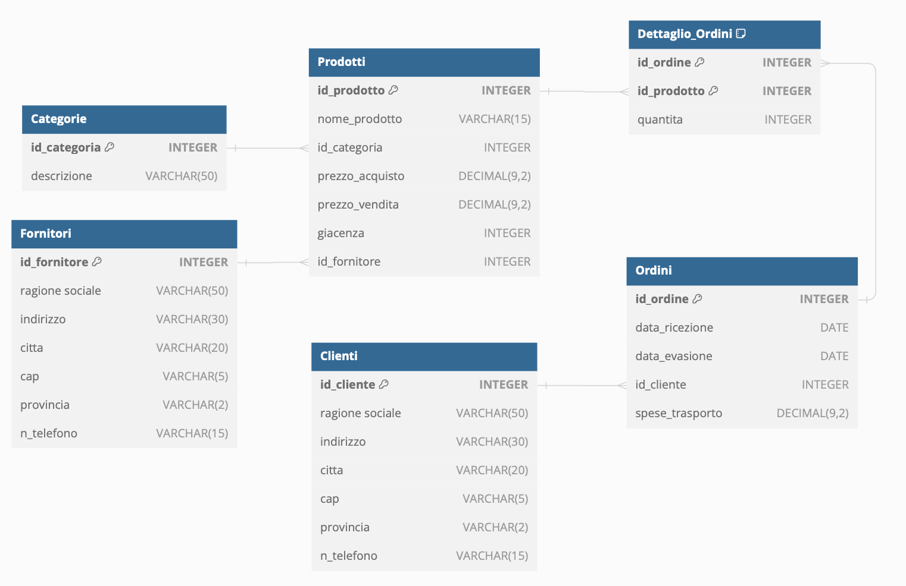
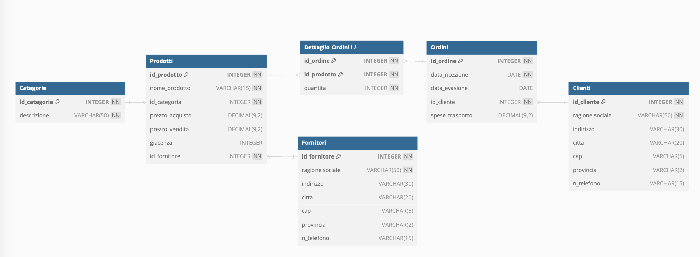

# ITIS5C
Appunti per lezioni

### SQL: A Relational Database Language

  When specifying a **relational algebra** query, it becomes the responsability of the user to specify **how** \-in what order\- to execute the query operations.

DBMSs provide (through **SQL**) a high\-level **declarative** language interface, so the user only specifies **what** the result is, leaving the actual optimization and decisions on how to execute the query to the DBMS.

Originally, SQL was called **SEQUEL**: for **S**tructured **E**nglish **QUE**ry **L**anguage.

(from *FUNDAMENTALS OF DATABASE SYSTEMS*, Elmasri-Navathe)

### Accesso MySQL

L'indirizzo IP del *DBMS server* è `10.25.0.14`

Sulle macchine Linux è installato il client **mysql** pertanto si può accedere alla console

```
mysql -h 10.25.0.14 -u <nome_utente_assegnato> -p
```

La password verrà richiesta interattivamente.

`CREATE DATABASE <nome_utente_assegnato>_test`

`USE <nome_utente_assegnato>_test`

A questo punto si può procedere con la serie di comandi *DDL*.

* **DDL** = *Data Definition Language* (`CREATE`, `ALTER`, `DROP`, ...) 
* **DML** = *Data Manipulation Language* (`INSERT`, `UPDATE`, `DELETE`, ...) e 
            *Data Query Language* (`SELECT`) 


### Esercizio



Trascurando per il momento la specificazione `NOT NULL` abbiamo quale esempio i seguenti *statement DDL*:

``` sql
CREATE TABLE "Categorie" (
  "id_categoria" INTEGER PRIMARY KEY,
  "descrizione" VARCHAR(50)
);

CREATE TABLE "Prodotti" (
  "id_prodotto" INTEGER PRIMARY KEY,
  "nome_prodotto" VARCHAR(15),
  "id_categoria" INTEGER,
  "prezzo_acquisto" DECIMAL(9,2),
  "prezzo_vendita" DECIMAL(9,2),
  "giacenza" INTEGER,
  "id_fornitore" INTEGER
);

CREATE TABLE "Fornitori" (
  "id_fornitore" INTEGER PRIMARY KEY,
  "ragione sociale" VARCHAR(50),
  "indirizzo" VARCHAR(30),
  "citta" VARCHAR(20),
  "cap" VARCHAR(5),
  "provincia" VARCHAR(2),
  "n_telefono" VARCHAR(15)
);

CREATE TABLE "Ordini" (
  "id_ordine" INTEGER PRIMARY KEY,
  "data_ricezione" DATE,
  "data_evasione" DATE,
  "id_cliente" INTEGER,
  "spese_trasporto" DECIMAL(9,2)
);

CREATE TABLE "Clienti" (
  "id_cliente" INTEGER PRIMARY KEY,
  "ragione sociale" VARCHAR(50),
  "indirizzo" VARCHAR(30),
  "citta" VARCHAR(20),
  "cap" VARCHAR(5),
  "provincia" VARCHAR(2),
  "n_telefono" VARCHAR(15)
);

CREATE TABLE "Dettaglio_Ordini" (
  "id_ordine" INTEGER,
  "id_prodotto" INTEGER,
  "quantita" INTEGER,
  PRIMARY KEY ("id_ordine", "id_prodotto")
);

ALTER TABLE "Prodotti" ADD FOREIGN KEY ("id_categoria") REFERENCES "Categorie" ("id_categoria");

ALTER TABLE "Prodotti" ADD FOREIGN KEY ("id_fornitore") REFERENCES "Fornitori" ("id_fornitore");

ALTER TABLE "Ordini" ADD FOREIGN KEY ("id_cliente") REFERENCES "Clienti" ("id_cliente");

ALTER TABLE "Dettaglio_Ordini" ADD FOREIGN KEY ("id_ordine") REFERENCES "Ordini" ("id_ordine");

ALTER TABLE "Dettaglio_Ordini" ADD FOREIGN KEY ("id_prodotto") REFERENCES "Prodotti" ("id_prodotto");
```


### SQL: interrogazione delle basi di dati

L'**Algebra Relazionale** è il fondamento teorico per la gesstione dei database relazionali.
L'**SQL** ne è una estensione semplificata (almeno nelle intenzioni!).
Il nome deriva, come già detto, dalla contrazione di **SEQUEL** (**S**tructured **E**nglish **QUE**ry **L**anguage). 
Tuttavia l'SQL si è confrontato con esigenze pratiche di implementazione ed uso.

La prima è la scelta di non implementare rigorosamente il principio dell'algebra relazionale 
che esclude i duplicati (le tuple identiche non possono esistere nell'algebra relazionale).
Per far si che una **SELECT** risponda a tale principio occorre imporre la clausola **DISTINCT** (è un vincolo *costoso* perchè sottintende l'ordinamento).

Gli altri due aspetti rigurdano l'uso:

* l'algebra relazionale è **procedurale**, l'SQL è **dichiarativo** (provvede il DBMS ad ottimizzare il processo per ottenere il risultato nel modo più efficiente e veloce)
* l'SQL offre degli operatori aggregati (COUNT, MIN, MAX, AVG, ecc) che non esistono nell'algebra relazionale ma sono utili nella elaborazione dei dati. 

### NON NULL

Sicuramente è opportuno che tutte le colonne che compongo *chiavi primarie* siano impostate a `NOT NULL`. Alcuni database lo impongono direttamente.

Tutte le colonne di una *foreign key* devono essere coerenti alle rispettive chiavi primarie per cui, fatta salva la precedente affermazione, è bene siano impostate a `NOT NULL`.

Per approfondire: *SQL Antipatterns: Avoiding the Pitfalls of Database Programming* di Bill Karwin

Per la logica trivalente ed SQL consultare [Wikipedia](https://en.wikipedia.org/wiki/Three-valued_logic)

Rivisitiamo la creazione dello schema del database utilizzando il file [A140withNULLs](A140withNULLs.sql) sfruttando la sequnza in apertura:

```
DROP DATABASE 5c<<cognome>>_test;
CREATE DATABASE 5c<<cognome>>_test;
USE 5c<<cognome>>_test;
```
Queste istruzioni sono coerenti con il seguente modello logico dove `NN` sta esattamente per **NOT NULL**.



### INSERT INTO ...

Inserire dati nella base dati tramite una serie di comandi `INSERT`: 

| id_categoria |  descrizione  | 
|:------------:|:-------------:|
|       1      |  giocattoli   | 
|       2      |  libri        | 
|       3      |  cartoleria   | 


impostando un file inizi con:

``` sql
USE 5c<<cognome>>_test;
DELETE FROM Dettaglio_Ordini;
DELETE FROM Ordini;
DELETE FROM Prodotti;
DELETE FROM Fornitori;
DELETE FROM Clienti;
DELETE FROM Categorie;
INSERT INTO Categorie VALUES(1, 'giocattoli');
INSERT INTO Categorie VALUES(2, 'libri);
INSERT INTO Categorie VALUES(3, 'cartoleria');
INSERT INTO Fornitori (id_fornitore, ragione_sociale) VALUES(1, 'Pluto srl');
```
